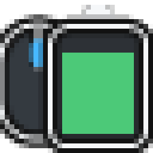

# G HUB Battery Tray

A small Windows tray app that shows battery levels reported by Logitech G HUB.



- One tray icon per selected device
- Last known reading stays visible while a device sleeps or disconnects
- Event-driven reconnect refresh with a 45-second polling fallback
- Optional per-user startup with Windows

## Install

Download the `win-x64`, `win-x86`, or `win-arm64` build from [Releases](../../releases/latest). Use the `setup.exe` installer or the standalone `portable.exe`. Both are self-contained; G HUB must be running, but no separate .NET installation is required.

## Build

Requires the .NET 10 SDK.

```powershell
dotnet restore GHubBatteryTray.slnx
dotnet test GHubBatteryTray.slnx --configuration Release --no-restore
dotnet run --project src/GHubBatteryTray/GHubBatteryTray.csproj
```

Installers are built from `installer/GHubBatteryTray.nsi` with NSIS.

The G HUB battery protocol is undocumented and may change. See [protocol notes](docs/ghub-protocol.md) and [architecture](docs/architecture.md).
